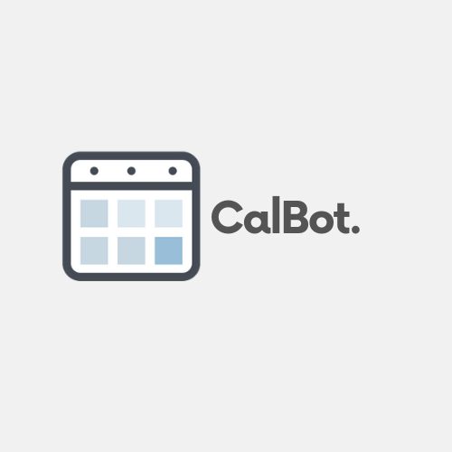
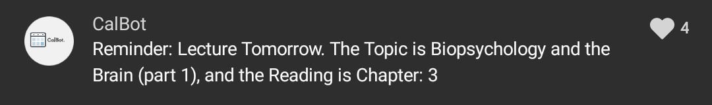

# CalBot

CalBot is a Calendar Bot written in Python that sends out reminders through the GroupMe API 

It sends out reminders before readings, assignments, and exams in my Psychology class participants chat of 250+ people.

I noticed that the Class had a ton of stuff due and I personally couldn't keep up, so I figured I might as well help some more people by creating it.

The first part of the project was to scrape table data from a PDF syllabus. Some classes in this repo are focused on extraction and making the data usable, which was done through multiple transformations using Pandas, and finally producing some clean data

The data was then used to schedule reminders.

The bot also allows invokation, which is pretty useful

The project was great, it taught me a lot about http requests and APIs!
